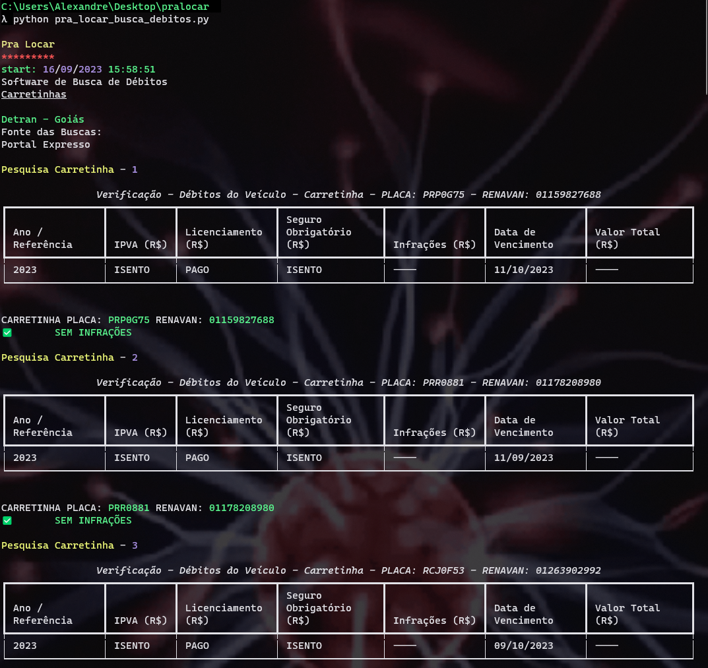
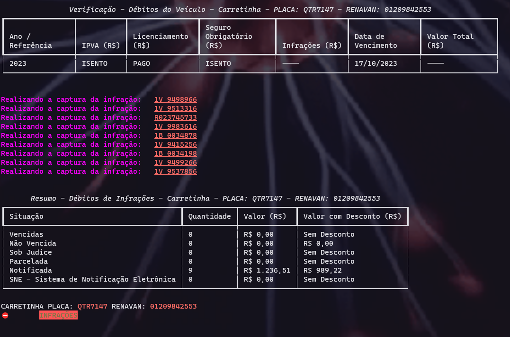
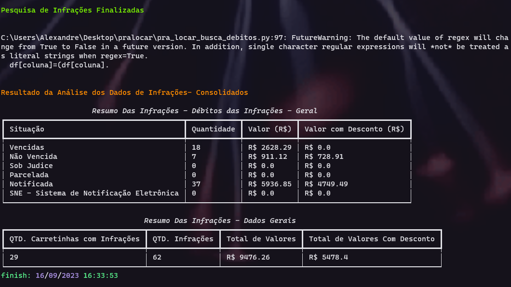

# Aplicação Brusca de infrações

#### Situação Problema:
O Estabelecimento comercial **Pra Locar** - Alugueis de Carretinhas.  
Necessita monitorar a ocorrência de Infrações para responsabilizar os clientes em tempo hábil, entrando no portal do Detran Goiás - GO e realizar a busca de infrações manual, no entanto essa atividade demanda tempo, então o cliente precisa de uma ferramenta que realize essa busca manual das infrações.
#### Objetivos:
* Realizar a pesquisa dos Veículos
* Realizar a Captura das Infraçoes  
  
De acordo com a necessidade do cliente será proposto a seguinte arquitetura do Projeto:
- Web Sctaping  
1 - Aplicação Web -> Aplicação Alvo  
2 - Busca das Informações  
3 - Captura das Informações   
4 - Gerando Report

**Arquivos Gerados**
- Prints das Infrações
- Arquivo .CSV

**Tecnologias**
- Playwright
- Python

**Bibliotecas Utilizadas**  

```
from rich.console import Console
from rich.table import Table 
from rich import print 
from datetime import datetime
from time import sleep
from playwright.sync_api import sync_playwright
import pandas as pd
import shutil
import webbrowser, os
```

**Saída**  
   
As informações derão se o veículo tem infrações será apresentada via console  
E no final da operação será apresentadas duas tabelas com o resumo das Infrações Localizadas.

## Report


Os dados apresentado via console  
Apresenta as seguintes informações:
* Identificação da empresa
* Data e hora que a exttação foi iniciada
* A fonte da extração dos Dados
* Pesquisando Carretinhas
* Tabela contendo informações Gerais
* Status

**Se Ocorrer Infrações**  

Observa - se as seguintes informações:
* Identificação do veículo
* Captura das Infrações
* Tabela indicando essas infrações
* Status

**Finalização das Buscas**  

Nota - se que ao Final da Busca de Infrações é Gerado:
* Tabela com as Informações Consolidadas
* E Data e Gora de todo o Processo Finalizado

# Documentação da Aplicação
Descrição dos métodos utilizados:  
A aplicação foi desenvolvida em python utilizando as seguintes bibliotecas  

```
from rich.console import Console
from rich.table import Table 
from rich import print 
from datetime import datetime
from time import sleep
from playwright.sync_api import sync_playwright
import pandas as pd
import shutil
import webbrowser, os
```

**console = Console(record=False)**  
A criação desse objeto console, será responsável, para realizar o print da tabela formatada   
```
#Caminho objeto alvo para a extração dos Dados
url="https://www.go.gov.br/servicos-digitais/detran/consulta-veiculos"

# Dados Referente as Registros Placa e Renavam
df= pd.read_csv('./data/carretinhas.csv', sep=';')
```
Algumas informações importante sobre algumas variáveis:
* url: contem o endereço web da aplicação que será objeto alvo
* df: Contem os registros das Placas e Renavam em formato .CSV onde será consumido pela aplicação  

**print()**  
O print utilizado pela aplicação é um print customatizado

```
diretorio = './carretinhas/infracoes/'         
if(os.path.exists(diretorio)):
    shutil.rmtree(diretorio)
    
diretorio_resultData='./carretinhas/data/'
if(os.path.exists(diretorio_resultData)):
    shutil.rmtree(diretorio_resultData)

os.mkdir(diretorio_resultData)
```
O trecho de código acima cria um diretório e se o mesmo ele irá apagar(excluir).
Esses diretórios serão gravados os prints(captura) das infrações e o arquivo .CSV gerado ao final do processo.

```
def data_agora():
   data = datetime.now()
   data2 = data.strftime("%d/%m/%Y %H:%M:%S") 
   return data2

#Configuração
def navegar():
    playwright = sync_playwright().start()  
    browser = playwright.chromium.launch(headless=True)
    page = browser.new_page()
    return page, browser, playwright

page, browser, playwright = navegar()
page.goto(url)

def encerrar():
    browser.close()
    playwright.stop() 
```
Para o melhor andamento da aplicação e ao mostrar para o usuário foi criado o método data, que irá retornar a data formatada.  
Sobre os métodos comentado como configuração temos:
* Navegar: Onde terá a engrenagem do playwright, configuração do browsere a pagee
* Método encerrar: responsável por finalizar o navegar.

```
#variáveis Identificação dataSet
coluna_situacao = 'Situação'
coluna_quantidade = 'Quantidade'
coluna_valor = 'Valor (R$)'
coluna_valor_desconto ='Valor com Desconto (R$)'
vencida = 'Vencidas'
nao_vencidas = 'Não Vencida'
sob_judice ='Sob Judice'
parcelada ='Parcelada'
notificada ='Notificada'
sne ='SNE - Sistema de Notificação Eletrônica'

#Variável responsável para a ciação do doc .csv
info_infracoes = 'Placa;Quantidade;Valor (R$);Valor com Desconto (R$);Situação\n'
```

No comentário **#Mapeamento** -Está os elementos html, mepeados da aplicação web  
Métodos:  
* inicio_busca(placa, renavan): Responsável pela Busca das Informações
* regularizar_dados(df, coluna): Irá formalizar os Dados do DataFrame Gerado após as Buscas
* soma_dataframe(df, condicao1, condicao2,condicao3): Método responsável por Consolidar as Informações.

### 

>[!IMPORTANT]
>
>A aplicação para realizar a interação deve ser mais lenta, para um desepenho melhor não em performance mas sim garantir que as extrações ocorram de forma mais assertiva então foi utilizado a estratégia de aguardar alguns segundos.
